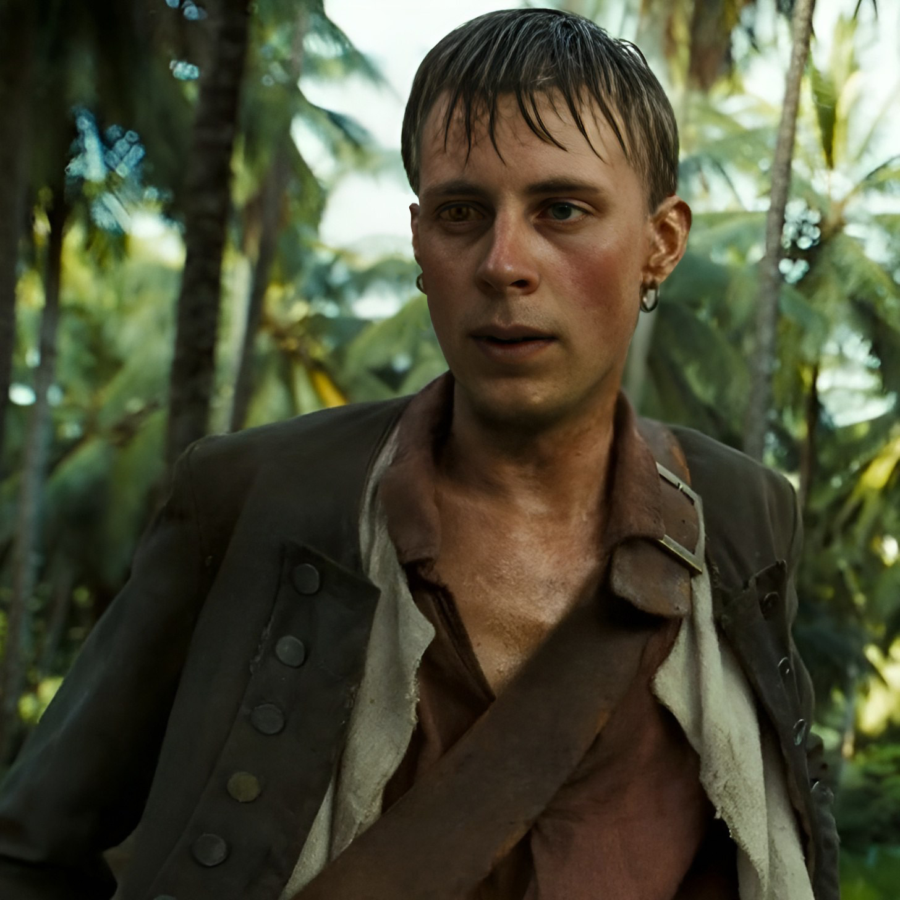

<h1>Pirate Quest</h1>

    This is an educational material provided by my good friend and teacher,
    designed to be studied in a quest format.

    

<h2>Description</h2>

    This educational material immerses us into the world of piracy and JS
    syntax. Soon, our ship will set sail and venture deep into the ocean. The
    most important thing is to have enough rum in the hold, and we'll manage the
    rest. Our ultimate goal is to create a website or a Telegram bot using
    NodeJS and additional libraries. Let's see what we can achieve. This is the
    basic information about the pirate quest.

